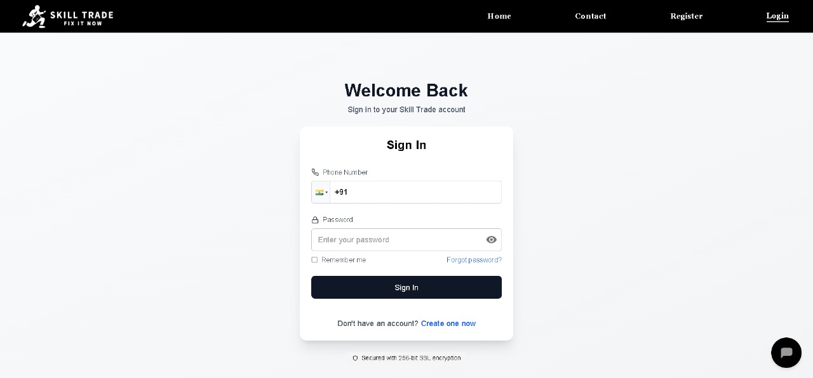

# 🛠️ SkillTrade

**SkillTrade** is a web-based platform that connects users with skilled professionals such as electricians, plumbers, painters, and more. It simplifies the process of finding and booking trusted service providers for daily needs.

---

# 🧰 Tech Stack

| Area       | Technology          |
|------------|---------------------|
| Frontend   | Next.js             |
| Backend    | Node.js, Express.js |
| Database   | MongoDB             |
| Auth/ORM   | JWT, Mongoose       |

**Other Integrations:**  
🗺️ HERE Maps API | 📧 Nodemailer 

---
# ✨ Features
- 🔍 Browse nearby professionals
- 🔐 JWT-based auth for security
- 📍 Location-based service listings
- 📩 Email confirmation on booking  
- 📊 Admin/service provider dashboards 
---

# 🖼️ Screenshots

### 🏠 Home Page 
  

### 🔐 Login Page  
  


---

# 🔄 Project Workflow

1. 🔍 User visits the platform and browses available services  
2. 🔐 Registers/logs in using their email  
3. 🛠️ Selects a service (e.g., plumber or electrician)  
4. 📍 Receives location-based options using HERE Maps API  
5. 📅 Books a timeslot for service  
6. 📩 Email confirmation is sent (if configured)  
7. 📊 Admin/service providers manage bookings from their dashboard  

---

# ✅ Prerequisites

Ensure you have the following installed:

- Node.js  
- MongoDB (local or [MongoDB Atlas](https://www.mongodb.com/cloud/atlas))  
- Git  
- HERE Developer Account (from [developer.here.com](https://developer.here.com/))

---

# 📦 Installation Guide - SkillTrade

## 🔁 Fork & Clone the repository
---
#### 1. Fork the Repository
Click the Fork button at the top right of this repository page to create your own copy.

#### 2. Clone Your Forked Repository
```bash
git clone https://github.com/AyushSharma72/Skill_Trade.git
```
#### 3. Navigate to the Project Directory
```bash
cd Skill_Trade
```

## ⚙️ Frontend Setup
---
#### 1. Navigate to the frontend directory
```bash
cd skill
```
#### 2. Install Dependencies
```bash         
npm install
```
#### 3. Environment Configuration     
Create a .env.local file in the skill directory:

```bash
# Create and edit the environment file
touch .env.local && nano .env.local
```
```env
# API Configuration
NEXT_PUBLIC_BASE_URL=http://localhost:8000
NEXT_PUBLIC_HERE_API_KEY=your_here_maps_api_key
```
#### Environment Variables Explanation:
- NEXT_PUBLIC_BASE_URL: Backend server URL (default: http://localhost:8000)
- NEXT_PUBLIC_HERE_API_KEY: HERE Maps API key for location services

#### 4. Start the Development Server
```bash
npm run dev
```

#### ✅ Frontend is now running at: http://localhost:3000


## 🔧 Backend Setup  
---
#### 1. Navigate to the backend directory
```bash
cd ../server
```
#### 2. Install Backend dependencies
```bash
npm install
```
#### 3. Environment Configuration
```bash
# Create and edit the environment file
touch .env && nano .env
```
```env
# Database Configuration
DB_CONNECT=your_mongodb_connection_uri

# Email Configuration (Optional)
email_id=your_email@example.com
pass_key=your_email_app_password

# Server Configuration
PORT=8000
SECRET=UJSBBFGSIERNFDJDKKSJ
```
 
#### Environment Variables Explanation:
- DB_CONNECT=Your MongoDB connection URI
- email_id=Email address for email features (optional)       
- pass_key=App password for email authentication (optional)      
- PORT=Port number for the server (default: 8000)
- SECRET=Secret key for JWT token generation

#### 4. Start the backend server
```bash
npx nodemon server
```

#### ✅ Backend server is now running at: http://localhost:8000

---

# 🚀 Contributing to SkillTrade  

#### Step 1: Create a new branch for your feature or fix
```bash
git checkout -b your-feature-name
```

#### Step 2: Stage all your changes
```bash
git add .
```

#### Step 3: Commit your changes with a meaningful message
```bash
git commit -m "Add: <your meaningful commit message>"
```

#### Step 4: Push your branch to your GitHub fork
```bash
git push origin your-feature-name
```

#### Step 5: Open a Pull Request
 👉 Go to your forked repository on GitHub

 👉 You’ll see a "Compare & pull request" button

 👉 Click it to open the PR

 👉 Add a descriptive title, clear description, and screenshots if relevant

 👉 Submit the pull request for review


---
# 📌 Contribution Notes

#### ✅ Always pull the latest changes from the main branch before starting new work

```bash
git checkout main
git pull origin main
```

#### ✅ Use clear, meaningful commit messages

```bash
git commit -m "Fix: responsive issue on login page"
```

#### ✅ Follow a consistent folder and file structure
 - Keep component names capitalized (e.g., UserCard.js)
 - Group related files logically

#### ✅ If contributing as part of a program (like GSSoC), mention it in your PR description
- Example: "This PR is part of my contribution to GSSoC 2025"

#### ✅ Don’t forget to update your fork regularly

```bash
git fetch upstream
git merge upstream/main
```
---

# 📞 Contact

For questions, bugs, or support:  
👉 [Open an issue](https://github.com/AyushSharma72/Skill_Trade/issues)